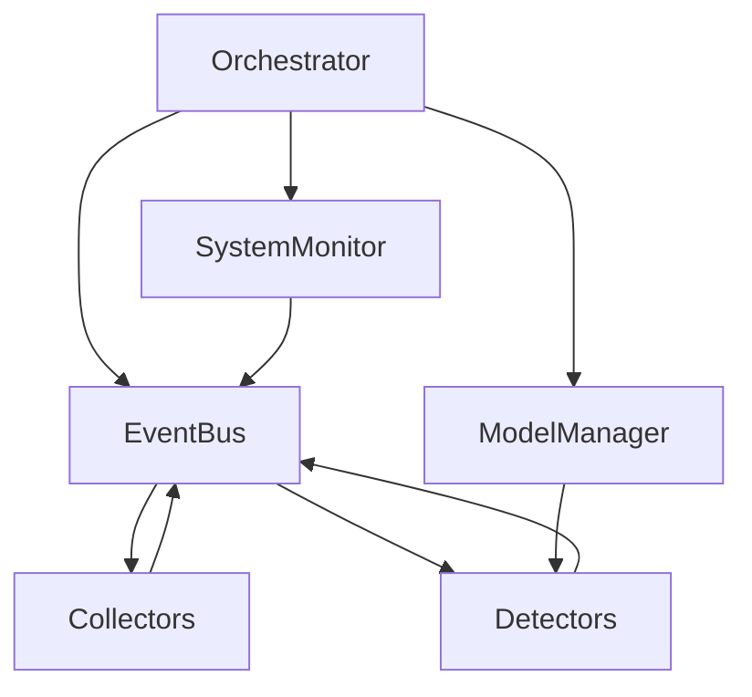

# 系统架构概览

重构后的多模态采集与检测平台围绕「配置驱动 + 事件总线 + 可插拔组件」的理念搭建。核心组件如下：

- **配置层（`config/*.yaml`）**：定义采集器、模型与检测器的启用状态及参数，可在运行时调整。
- **事件总线（`src/core/event_bus.py`）**：Collector 与 Detector 之间通过事件发布/订阅进行解耦通信。
- **调度中心（`src/core/orchestrator.py`）**：根据配置加载组件、管理生命周期，并负责统一日志与系统监控。
- **数据采集器（`src/collectors`）**：实现摄像头、传感器与文件目录监听等多模态数据源，可平滑切换硬件与模拟数据。
- **模型管理器（`src/models/model_manager.py`）**：支持 PyTorch/ONNX 等多模型统一装载与推理调用，默认以桩实现保障在无模型文件时也可运行。
- **检测模块（`src/detectors`）**：监听事件并执行推理、规则判断或文件摘要，结果以 `detector.result` 事件广播。
- **系统监控（`src/core/system_monitor.py`）**：周期性采集 CPU/内存等运行状态并写入事件总线，便于统一观测与告警。
- **接口层（`src/interfaces/`）**：Orchestrator 可按配置加载 WebSocket 等对外接口，将内部事件总线的结果推送到外部系统。
- **桌面前端（`ui/`）**：PyQt5 监控看板订阅 WebSocket 事件，负责可视化与提醒；业务测评界面支持「正常 / 调试」双模式，前者依赖真实设备、后者会在未连接后端或无硬件时自动切换到模拟信号。旧版界面以兼容模块保留。

整体流程如下：

```text
配置加载 → Orchestrator 创建事件总线 →
├─ Collectors 启动并产生事件（camera.frame / sensor.packet / file.batch）
├─ ModelManager 按需加载模型
├─ Detectors 订阅相关事件并结合模型输出检测结果
└─ SystemMonitor 持续发布 system.heartbeat 供外部观测
```

## 主要改进要点

1. **模块边界清晰**：Collectors / Models / Detectors 各司其职，依赖通过事件与管理器注入。
2. **配置热插拔**：通过 YAML 配置即可启停组件与调整参数，降低二次开发成本。
3. **无硬件回退**：摄像头与传感器均提供模拟模式，CI 环境下也能跑通数据链路与测试；UI 通过 `UI_DEBUG_MODE`/`UI_FORCE_SIMULATION` 环境变量或 `--debug` 启动参数显式切换，`AVService` 遇到设备不可用时会自动切换到合成帧生成器并在日志中提示。
4. **日志标准化**：借助 `utils/logger.py` 的 `dictConfig` 模板将日志拆分至不同子目录，方便问题定位。
5. **测试友好**：`tests/` 目录提供单元与集成测试，确保核心链路的可回归性。

## 服务层近期开发

- **TTSService**：新增 PowerShell 朗读超时监测与自动回退逻辑，当系统语音接口在指定时间内无响应时，会暂时禁用该后端并切换到 `pyttsx3` 完成播报，同时保持调用方的语速与音量设置。
- **DatabaseService**：在连接失败时主动抛出 `DatabaseUnavailable`，并附带底层错误信息，便于 UI 与外部监控快速定位数据库状态。

## 模块依赖关系



## 目录结构映射

| 目录 | 说明 |
| ---- | ---- |
| `src/utils` | 日志、配置与线程安全工具 |
| `src/core` | 调度中心、事件总线、系统监控 |
| `src/collectors` | 多模态数据采集器实现 |
| `src/models` | 模型封装与统一管理 |
| `src/detectors` | 检测逻辑实现与事件响应 |
| `data/` | 原始、处理后与结果数据存储路径 |
| `logs/` | 采集、模型、检测日志分类保存 |
| `tests/` | 单元与集成测试 |
| `ui/` | 桌面端监控看板与兼容层 |
| `src/interfaces` | 对外接口（WebSocket 等） |

该架构可扩展至更多设备与模型，只需新增对应的 Collector / Detector，实现最小耦合。
